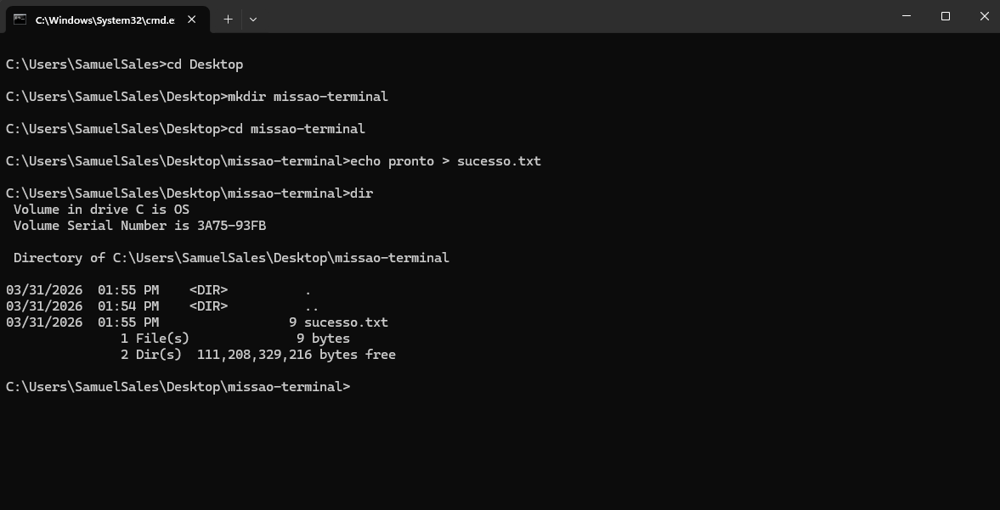

# una-ihcux-lista01

# ⚡ Meus Comandos Favoritos
Aqui estão os comandos que mais utilizei na aula de Terminal:

- `cd`: Para navegar entre pastas.
- `dir`: Para listar arquivos.
- `cd ..`: Para voltar uma pasta na hierarquia de diretórios.
- `copy`: Para criar uma cópia de arquivos em um novo destino.
- `move`: Para mover arquivos de lugar ou renomear pastas e arquivos.

## 📸 Evidência de Execução
